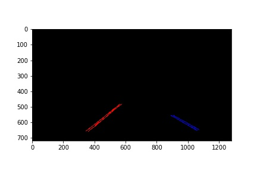
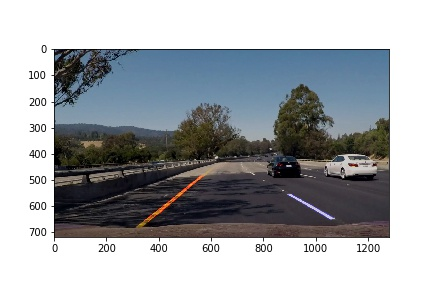
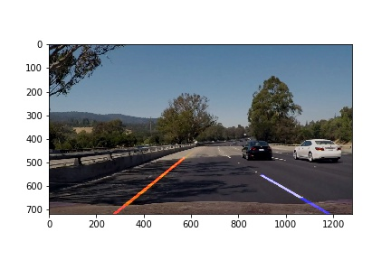

# **Finding Lane Lines on the Road** 

## Objectives

The goals / steps of this project are the following:
* Make a pipeline that finds lane lines on the road
* Reflect on your work in a written report

## Reflection

### 1. Pipeline
My pipeline consists of the following steps
1. color_threshold: to filter white/yellow
2. grayscale: to allow edge detections
3. gaussian_blur: to get rid of random noise
4. Canny filter: to detect the high gradients
5. region filter: to ignore locations where the lines cannot be
6. hough filter: detect the straight lines
7. line averaging: to determine the actual left and right lines

The color threshold seems to be rather inaffective, as it can create very strong gradients by itself.

I have modified the hough filter, to group the lines in (potential) left and right lines. For this, I implemented a filter based on the slope of the lines

In step 7, these identified left and right lines are averaged, where I use the length as a weight factor. In this way, I can keep the length limit in the hough filter low (good for the additional challenge), but minimize the effect of small artifact lines.

I have tried to improve also for the challenge video. I have extracted some screenshots to improve the pipeline more quickly, and afterwards processed the video itself.

  
**Hough detected and slope filtered lines**

  
**Filtered and averaged lines**

All other images of all intermediate steps can be found in [test_output](./test_output), while all output videos can be found in [test_videos_output](./test_videos_output)

### 2. Shortcomings with this pipeline
1. Curved lines will not be detected
2. The slope filter should be dynamic, based on the slopes found. Now, hard limits are used, but the limits should be based on the slopes that are actually detected
3. Due to the region and slope filter, lane changes will cause problems

### 3. Possible improvements
1. Improve the color filter. This can be done by transforming to HSB color space, and filter there for yellow. However, white is probably better detected in RGB or Grayscale, so the merging becomes complex.
2. Improve the slope filter, as indicated above
3. For curved lines, something else then hough should be used

